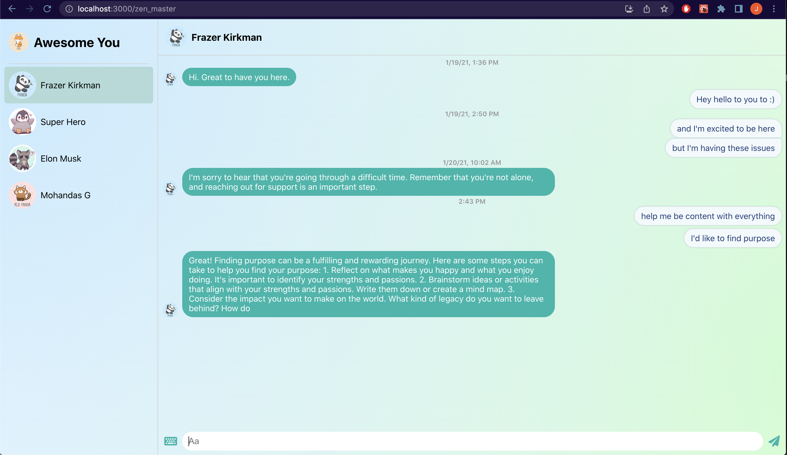

# AwesomenessCoach
Helping you be more awesome

#Inspiration
Human mind is the most underutilized resources in the world and learning how to program my brains directly can bring us peace and joy beyond what most people know is possible.

#What it does
The Awesomeness coach is a chatgpt interface. We can discuss improving your life with different personalities. He will help you train your mind to be better. It's also a social app where you can talk with friends and family, in the context of trying to lift each other up.

#How we built it
Were using the openAI API, talking to a react app.

We planned out self reflecting prompts to give the user the most actionable suggestions.

#Challenges we ran into
we spent a day trying to take existing class transcriptions, break them in to chunks and put them into Datastax as vector representations so that we could find relevant class topics as part of our prompt to chatGPT, and use LangChain to control the prompting flow. we found integrating this to be harder than we expected, and didn't get it in.

#Accomplishments that we're proud of
Our UI is very nice.  This was baased on Clover Chat, previously built by our team mate Jenny Chen

#What's next for Awesomeness coach
Integrate the vector database to create more inspired prompts Improve the social aspect